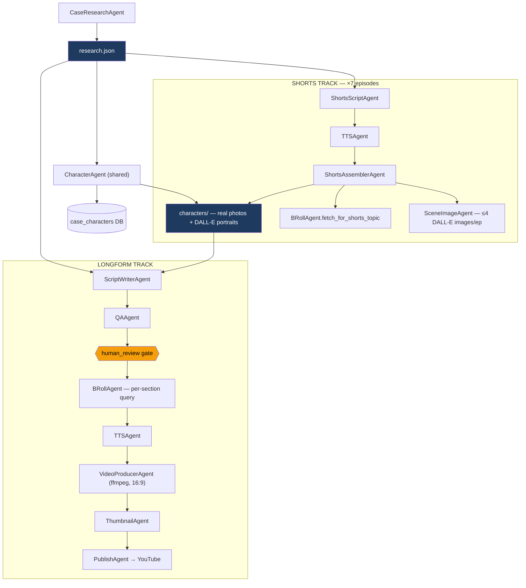

# Architecture — Technical Diagrams & Decisions

> Last updated: 2026-06-20 (SaaS-shaped re-architecture pass)
> Reflects `src/` and `frontend/` as they actually exist. Update this file
> whenever the real structure changes — do not let it go stale again.
> All new architecture must satisfy `docs/SAAS_DESIGN.md`.

---

## 0. Infrastructure Model

```
┌──────────────────────────────────────────────────────────┐
│                  LOCAL MACHINE                            │
│                                                            │
│  ┌──────────────────┐      ┌──────────────────────────┐  │
│  │ Next.js frontend │ ───► │ FastAPI backend           │  │
│  │ (control room)   │      │ src/api/  (REST + SSE)    │  │
│  └──────────────────┘      └──────────┬───────────────┘  │
│                                        │                  │
│                             ┌──────────▼───────────────┐  │
│                             │ Agents (src/agents/)     │  │
│                             │ run in background threads│  │
│                             └──────────┬───────────────┘  │
│                                        │                  │
│  ┌─────────────────────────────────────▼────────────────┐ │
│  │  data/cases/{slug}/  — all case files, local disk    │ │
│  └────────────────────────────────────────────────────────┘ │
└──────────────────────┬────────────────────────────────────┘
                       │
         ┌─────────────┴──────────────────┐
         ▼                                ▼
┌─────────────────┐              ┌──────────────────────┐
│  Neon (Postgres)│              │  External APIs        │
│  cases, scripts,│              │  Gemini, Sarvam,      │
│  videos, etc.   │              │  Pexels, DALL-E 3,    │
└─────────────────┘              │  YouTube Data API     │
                                  └──────────────────────┘
```

---

## 1. Two-Track Pipeline (the core architectural decision)

Only `research.json` is shared. Everything downstream forks into two completely
independent tracks — neither reads the other's output. This is enforced in
`frontend/lib/pipeline.ts` (`ORDERED_PIPELINE`, `track: 'shared' | 'longform' | 'shorts'`)
and mirrored in the backend route split (`src/api/routes/pipeline.py`).

```
                        research.json
                              │
                    ┌─────────┴─────────┐
                    │   characters step  │   (shared, runs once)
                    │  CaseCharacter rows │
                    │  + real photos      │
                    │  + DALL-E portraits │
                    └─────────┬─────────┘
                              │
              ┌───────────────┴────────────────┐
              ▼                                 ▼
   ┌─────────────────────┐          ┌──────────────────────────┐
   │   LONGFORM TRACK     │          │     SHORTS TRACK          │
   │                       │          │  (7 independent episodes) │
   │  script_writer_agent │          │  shorts_script_agent       │
   │         │             │          │         │                  │
   │   QA + human_review   │          │  shorts_tts_agent (Sarvam) │
   │         │             │          │         │                  │
   │   broll_agent         │          │  shorts_assembler_agent    │
   │   (per-section query) │          │  - ensure_topic_broll      │
   │         │             │          │  - char photo / portrait   │
   │   tts_agent (Sarvam)  │          │  - scene_image overlay     │
   │         │             │          │  - hook frame + captions   │
   │   video_producer_agent│          │         │                  │
   │   (ffmpeg, 16:9)      │          │  7× {topic}.mp4 (9:16)     │
   │         │             │          └──────────────────────────┘
   │   thumbnail_agent     │
   │         │             │
   │   publish_agent → YT  │
   └─────────────────────┘
```

**Why this split is enforced, not just convention:** see `docs/SAAS_DESIGN.md` §2.
A future case loaded with only a shorts run, or only a longform run, must work with
zero code branching on "did the other track run."

### 1.1 Dependency Graph

Mermaid — renders natively in GitHub/VS Code (with the `vscode-markdown-mermaid`
extension) preview, no install required. This is the actual import/data graph, not
an aspirational one — cross-check against `src/agents/*.py` imports before trusting
it after future changes.



Note the only edges crossing into both subgraphs are `research.json` and
`characters/` (+ `TTSAgent`/`BRollAgent` as shared utility classes, not track-owned
orchestration) — this is the §2 rule made visible. If a future edit adds an edge
from inside `LONGFORM` to inside `SHORTS` (or vice versa) that doesn't pass through
one of these shared nodes, that's the coupling violation to catch.

For an **interactive** version with live per-node status (done/running/pending) inside
the dashboard itself, React Flow (reactflow.dev) is the standard choice for this kind
of node/workflow UI — same library class that n8n-style editors are built on. Not yet
built; candidate for a future phase if the static graph above isn't enough.

---

## 2. Agent Communication Pattern

Each agent reads/writes via:
1. **PostgreSQL** (`src/db/models.py`) — structured status, metadata
2. **`data/cases/{slug}/`** — raw files (JSON, MP3, MP4, PNG)
3. **`CaseState`** (`src/pipeline/state.py`) — typed dataclass passed between agents in-process

```python
@dataclass
class CaseState:
    slug: str
    name: str
    research_path: str | None
    script_path: str | None
    draft_script_path: str | None
    audio_path: str | None
    timings_path: str | None
    broll_dir: str | None
    video_path: str | None
    thumbnail_path: str | None
    shorts_episode_paths: list[str]
    shorts_video_paths: list[str]
    status: str
```

No agent imports another track's agent except where explicitly justified:
`shorts_assembler_agent.py` imports `broll_agent.BRollAgent` (real Pexels fetch, not
duplicated) and `scene_image_agent.SceneImageAgent` (composition, not a track boundary
violation — both are shared visual-sourcing utilities, not longform-track code).

---

## 3. Shorts Visual Sourcing Pipeline

```
_assemble_episode(topic_slug)
        │
        ▼
1. _ensure_topic_broll()        ──► broll_agent.fetch_for_shorts_topic()
   (real Pexels fetch, exact      Pexels search by SHORTS_TOPIC_QUERY[topic]
    filename broll/{topic}.mp4,    → cache in broll_cache table → copy to
    only if missing)                exact filename assembler expects
        │
        ▼
2. _pick_character_photo()       DB role lookup (_TOPIC_ROLE_MAP) → real photo
   (3 of 7 topics)                or AI portrait from characters/ dir
        │
        ▼
3. _load_or_generate_scene_manifest()  ──► scene_image_agent.SceneImageAgent
   (cached after first run)        DALL-E 3 per-segment scene images,
                                    capped at 4/episode (hook + reveal +
                                    character-matched segments)
        │
        ▼
4. _prepare_vertical_broll()     blur-box crop landscape → 1080×1920
        │
        ▼
5. _overlay_scene_images()       time-gated overlay during each segment's
                                  [start,end] window — replaces b-roll only
                                  for that window, same technique as captions
        │
        ▼
6. _add_hook_and_captions()      hook frame (0-3s) + burned-in captions
        │
        ▼
7. normalize audio + final encode → {topic}.mp4
```

Visual source priority is documented as policy in `docs/SAAS_DESIGN.md` §3 — any new
shorts visual feature must declare where in this priority chain it sits.

---

## 4. Longform Video Assembly (FFmpeg, no MoviePy)

```
Script segments (with word_timings from Sarvam TTS)
        │
        ▼
For each section: select b-roll (broll_agent, per-section Pexels query)
        │
        ▼
ffmpeg filtergraph: warm grade + vignette, text overlays, location stamp,
                    cross-dissolve between sections
        │
        ▼
Mux: voiceover audio + b-roll video → H.264 1080p, AAC audio → video_final.mp4
```

---

## 5. Database Schema

See `src/db/models.py` for the authoritative SQLAlchemy models. Summary:

```sql
cases            -- topic-agnostic: slug, name, victim_name, perpetrator, case_type,
                 -- status, tier, parent_case_id + case_version (branching support)
articles         -- scraped news, optionally linked to a case
case_research    -- case_id, source_type, source_url, content, judgment_date
scripts          -- case_id, version, script_text, status, qa_notes, qa_attempts
videos           -- case_id, script_id, video_path, render_status, yt_video_id, yt_url
yt_analytics     -- video_id, date, views, watch_time_hrs, ctr, ...
case_characters  -- case_id, name, role, image_path, image_url, notes
broll_cache      -- query, file_path, source, license, duration_sec (shared across cases)
pipeline_log     -- case_id, agent, action, status, message, duration_sec
```

No table or column encodes a specific case, niche, or language. Hindi-specific behavior
(Devanagari regex, role keyword lists) lives in agent code as data structures, not schema.

---

## 6. File Structure (actual, as of this pass)

```
/
├── CLAUDE.md
├── docs/
│   ├── MASTER_REFERENCE.md
│   ├── TRACKER.md
│   ├── DATA_SOURCES.md
│   ├── ARCHITECTURE.md            ← this file
│   └── SAAS_DESIGN.md             ← design philosophy, read before any new feature
├── data/cases/{slug}/             ← see MASTER_REFERENCE.md §4.6
├── frontend/
│   ├── app/
│   │   ├── cases/page.tsx         ← case list
│   │   ├── cases/new/page.tsx     ← load a new case
│   │   ├── cases/[slug]/page.tsx  ← PipelineTab, two-column track view
│   │   ├── cases/[slug]/steps/[step]/page.tsx  ← step workspace
│   │   └── settings/page.tsx
│   └── lib/
│       ├── pipeline.ts            ← ORDERED_PIPELINE, track graph (source of truth)
│       ├── api.ts
│       └── swr-hooks.ts
└── src/
    ├── agents/                    ← see MASTER_REFERENCE.md §4.2
    ├── api/
    │   ├── main.py
    │   ├── routes/{cases,pipeline,steps,characters,scripts,audio,logs,agent}.py
    │   ├── agent/{core,tools}.py  ← Gemini function-calling ops agent
    │   ├── jobs.py                ← background job tracking
    │   └── versions.py
    ├── pipeline/{orchestrator,state}.py
    ├── scrapers/{indian_kanoon,cbi_scraper,ncrb_downloader,news_api,rss_monitor}.py
    ├── db/{models,session}.py
    └── video/{assembler,audio_mixer,palette,templates}.py   ← longform-only ffmpeg helpers
```

---

## 7. Environment Variables

```bash
# LLM
GEMINI_API_KEY=

# TTS
SARVAM_API_KEY=

# Video / Images
OPENAI_API_KEY=          # DALL-E 3: thumbnails, character portraits, scene images
PEXELS_API_KEY=

# Legal / news data
INDIAN_KANOON_TOKEN=
NEWS_API_KEY=

# YouTube
YOUTUBE_CLIENT_ID=
YOUTUBE_CLIENT_SECRET=
YOUTUBE_REFRESH_TOKEN=

# Database
DATABASE_URL=postgresql://...neon.tech/...?sslmode=require

# App
ENVIRONMENT=development
LOG_LEVEL=INFO
DATA_DIR=./data
```
